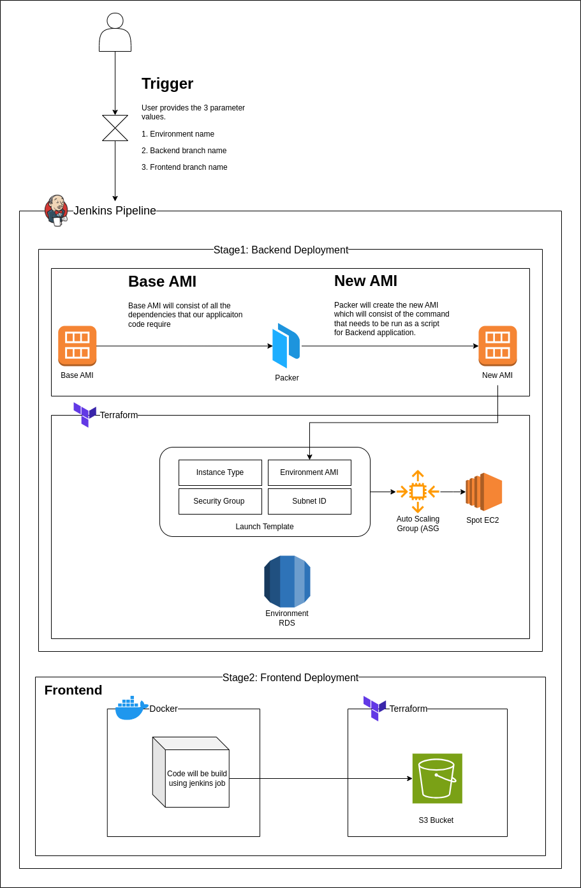

# 🚀 OneClickAutomation

> **End-to-end infrastructure provisioning in minutes, not hours**

Spin up **short-lived demo environments on AWS** with a single Jenkins pipeline click. Couples Jenkins orchestration, Packer image builds, and Terraform infrastructure-as-code to automate backend, database, and frontend deployment with zero manual steps.

---

## 📋 Table of Contents

- [✨ Highlights](#-highlights)
- [📂 Repository Layout](#-repository-layout)
- [🔄 Workflow Overview](#-workflow-overview)
- [🛠️ Tech Stack](#️-tech-stack)
- [🚀 Getting Started](#-getting-started)
- [📖 Detailed Setup](#-detailed-setup)
- [🔧 Configuration & Usage](#-configuration--usage)
- [❌ Troubleshooting](#-troubleshooting)
- [🤝 Contributing](#-contributing)
- [📜 License](#-license)

---

## ✨ Highlights

| Feature | Benefit |
|---------|---------|
| **One-click environments** | Jenkins parameters control everything—database snapshots, backend/frontend branches, environment creation |
| **Immutable infrastructure** | Packer bakes Laravel-ready AMIs with secrets, ensuring consistency across all EC2 instances |
| **Complete AWS integration** | Terraform manages RDS snapshots, Auto Scaling Groups, Route53 DNS, Elastic IPs, and S3 static hosting |
| **Lifecycle automation** | Companion pipeline tears down all resources (EC2, S3, RDS, AMIs, snapshots, DynamoDB) when done |
| **No manual steps** | Fully automated from code commit to live demo environment |


## 📂 Repository Layout

```
OneClickAutomation/
├── 📄 README.md                    # This file
├── 📄 LICENSE                      # Open-source license (TODO)
│
├── 📁 jenkins/
│   ├── 📄 dev-deployment/
│   │   └── Jenkinsfile             # Main deployment pipeline
│   │                                # Orchestrates all stages
│   │
│   └── 📄 dev-deletion/
│       └── Jenkinsfile             # Cleanup & teardown pipeline
│                                    # Reverse of deployment
│
├── 📁 packer/
│   ├── 📄 build.pkr.hcl           # Packer config
│   │                                # Amazon EBS builder
│   │                                # rc.local bootstrapper
│   │
│   └── 📄 variables.pkr.hcl        # Variable definitions
│
└── 📁 terraform/
    ├── 📁 EC2-S3/
    │   ├── 📄 main.tf              # Primary resources
    │   ├── 📄 variables.tf         # Input variables
    │   ├── 📄 outputs.tf           # Output values
    │   ├── 📄 user_data.tpl        # EC2 init script
    │   └── 📄 backend.conf         # Remote state config
    │
    └── 📁 RDS/
        ├── 📄 main.tf              # RDS resources
        ├── 📄 variables.tf         # Input variables
        ├── 📄 outputs.tf           # Output values
        └── 📄 backend.conf         # Remote state config
```

---

## 🔄 Workflow Overview

### Phase 1: Database (Optional)
- If `RDS_ENDPOINT=Production`: Terraform clones a snapshot of the production RDS instance into a sandbox environment with isolated security groups
- If `RDS_ENDPOINT=Development`: Pipeline reuses the shared dev database, reducing deployment time

### Phase 2: Backend AMI Build
- Packer uses the `amazon-ebs` builder to create a Ubuntu-based AMI
- Writes all application configuration into `/etc/rc.local` 
- Bakes secrets (DB credentials, API keys, Stripe tokens, etc.) into the image

### Phase 3: Infrastructure Deployment
- Terraform `EC2-S3` module allocates:
  - Elastic IP bound to environment name
  - Route53 record (e.g., `api.demo-v1.domain`)
  - Launch template from Packer AMI
  - Auto Scaling Group with spot instances
  - Timestamped S3 bucket for frontend assets

### Phase 4: Frontend Build & Deploy
- Dockerized Node toolchain clones frontend repo
- Injects Terraform outputs (API URLs, endpoints) into build
- Builds optimized SPA bundle
- Uploads static files to S3 bucket
- Configures S3 static website hosting

### Phase 5: Bookkeeping & Registration
- Environment metadata stored in DynamoDB for quick lookup
- Jenkins logs display:
  - Backend API URL
  - Frontend distribution URL
  - Elastic IP address
  - Environment expiration timestamp

### Phase 6: Cleanup & Deletion
- `dev-deletion` pipeline reverses the process:
  - Destroys RDS clones (if created)
  - Deregisters Packer AMIs
  - Deletes EBS snapshots
  - Tears down Terraform stacks
  - Removes DynamoDB entries
  - Clears S3 buckets

---

## 🛠️ Tech Stack

| Component | Technology | Purpose |
|-----------|-----------|---------|
| **Orchestration** | Jenkins | Pipeline coordination and execution |
| **VCS** | GitHub | Source code and infrastructure repos |
| **Image Building** | Packer | Immutable AMI creation |
| **Infrastructure** | Terraform | AWS resource provisioning (IaC) |
| **Compute** | AWS EC2 (Spot) | Backend application servers |
| **Database** | AWS RDS | Managed MySQL/PostgreSQL |
| **DNS** | AWS Route53 | DNS record management |
| **Storage** | AWS S3 | Static frontend hosting |
| **Metadata** | AWS DynamoDB | Environment tracking |
| **Runtime** | Laravel (Backend) | PHP web framework |
| **Frontend** | Node.js | SPA build toolchain |

---

## 🚀 Getting Started

### Prerequisites

Before deploying, ensure you have:

| Tool | Version | Purpose |
|------|---------|---------|
| **Terraform** | ≥ 1.5 | Infrastructure provisioning |
| **Packer** | ≥ 1.9 | AMI image building |
| **AWS CLI** | v2 | AWS credentials & configuration |
| **Node.js** | 18+ | Frontend build toolchain |
| **Docker** | 20.10+ | Container execution |
| **Git** | 2.30+ | Version control |
| **Jenkins** | 2.380+ | Pipeline orchestration |

### AWS Permissions Required

Ensure your AWS IAM user/role has permissions for:
- EC2 (CreateInstance, RunInstances, TerminateInstances, CreateImage)
- RDS (CreateDBInstance, DescribeDBInstances, DeleteDBInstance, CopyDBSnapshot)
- Route53 (ChangeResourceRecordSets)
- DynamoDB (PutItem, DeleteItem, Query)
- S3 (CreateBucket, PutObject, DeleteObject, DeleteBucket)
- VPC/Networking (DescribeSecurityGroups, DescribeSubnets, AllocateAddress)

## Deployment Flow



Backend workloads run on spot-backed EC2 instances in an Auto Scaling Group behind a dedicated Elastic IP/DNS record. Frontend assets are hosted from the timestamped S3 bucket (static website hosting), so new deployments receive a unique URL while sharing the same backend API.

### Quick Start (5 Minutes)

```bash
# 1. Clone the repository
git clone https://github.com/dhruvbardolia/OneClickAutomation.git
cd OneClickAutomation

# 2. Configure AWS credentials
aws configure

# 3. Initialize Terraform backend
cd terraform/EC2-S3
terraform init -backend-config=backend.conf

# 4. Create staging.tfvars
cat > staging.tfvars << 'EOF'
route53_zone_id    = "Z1234567890ABC"
root_domain        = "demo.example.com"
vpc_security_group_ids = ["sg-12345678"]
subnets            = ["subnet-12345678", "subnet-87654321"]
aws_region         = "us-east-1"
EOF

# 5. Validate Terraform
terraform plan -var-file=staging.tfvars

# 6. Build Packer image
cd ../../packer
packer init .
packer validate -var "AMI_NAME=demo-ami" build.pkr.hcl
```

---

## 📖 Detailed Setup

### Jenkins Configuration

#### 1. Install Required Plugins
```
- Pipeline
- GitHub Integration
- AWS Credentials
- Environment Inject
- Post Build Task
```

#### 2. Create Jenkins Credentials

Store these as Jenkins "Secret text" credentials:

```
ID: github-credentials          (GitHub PAT or username/password)
ID: rds-credentials            (MySQL root credentials)
ID: USER_PASSWORD              (Staging user password)
ID: APP_KEY                    (Laravel APP_KEY)
ID: AWS_ACCESS_KEY_ID          (AWS IAM key)
ID: AWS_SECRET_ACCESS_KEY      (AWS IAM secret)
ID: DB_HOST                    (Production DB hostname)
ID: SPARKPOST_SECRET           (Email service API key)
ID: BUGSNAG_API_KEY            (Error tracking API key)
ID: FCM_SERVER_KEY             (Firebase Cloud Messaging key)
ID: STRIPE_KEY                 (Stripe publishable key)
ID: STRIPE_SECRET              (Stripe secret key)
```

#### 3. Create Jenkins Pipeline Job

1. Go to Jenkins → New Item → Pipeline
2. Name: `OneClickAutomation-Deploy`
3. Check "This project is parameterized"
4. Add Parameters:

```groovy
NAME (String)
Default: demo-env-1
Description: Unique environment identifier

RDS_ENDPOINT (Choice)
Choices: Production, Development
Description: Clone production snapshot or use dev DB

BE_BRANCH_NAME (String)
Default: main
Description: Backend Git branch

FE_BRANCH_NAME (String)
Default: main
Description: Frontend Git branch
```

5. Set Pipeline script path: `jenkins/dev-deployment/Jenkinsfile`

---

## 🔧 Configuration & Usage

### Terraform Variables (terraform/EC2-S3/variables.tf)

```hcl
variable "route53_zone_id" {
  description = "Route53 hosted zone ID"
  type        = string
}

variable "root_domain" {
  description = "Root domain (e.g., demo.example.com)"
  type        = string
}

variable "frontend_bucket_suffix" {
  description = "S3 bucket suffix for uniqueness"
  type        = string
  default     = "frontend-spa"
}

variable "iam_profile" {
  description = "IAM instance profile for EC2"
  type        = string
}

variable "image_id" {
  description = "AMI ID from Packer build"
  type        = string
}

variable "instance_type" {
  description = "EC2 instance type"
  type        = string
  default     = "t3.small"
}

variable "key_name" {
  description = "EC2 key pair name"
  type        = string
}

variable "vpc_security_group_ids" {
  description = "Security group IDs"
  type        = list(string)
}

variable "subnets" {
  description = "Subnet IDs for ASG"
  type        = list(string)
}

variable "aws_region" {
  description = "AWS region"
  type        = string
  default     = "us-east-1"
}
```

### Packer Configuration (packer/build.pkr.hcl)

```hcl
packer {
  required_plugins {
    amazon = {
      version = "~> 1.2"
      source  = "github.com/hashicorp/amazon"
    }
  }
}

source "amazon-ebs" "laravel" {
  ami_name        = var.AMI_NAME
  instance_type   = "t3.small"
  region          = var.aws_region
  source_ami_filter {
    filters = {
      name                = "ubuntu/images/*ubuntu-jammy-22.04-amd64-server-*"
      root-device-type    = "ebs"
      virtualization-type = "hvm"
    }
  }
}

build {
  sources = ["source.amazon-ebs.laravel"]

  provisioner "file" {
    content = templatefile("${path.root}/rc.local.tpl", {
      app_key         = var.APP_KEY
      db_host         = var.DB_HOST
      be_branch       = var.BE_BRANCH_NAME
    })
    destination = "/tmp/rc.local"
  }

  provisioner "shell" {
    inline = [
      "sudo mv /tmp/rc.local /etc/rc.local",
      "sudo chmod +x /etc/rc.local",
      "sudo systemctl enable rc-local"
    ]
  }
}
```

---

## ❌ Troubleshooting

### Common Issues & Solutions

#### 1. **Terraform: "tfvars file not found"**

**Symptom:**
```
Error: Failed to read variables file: open terraform.tfvars: no such file or directory
```

**Solution:**
```bash
# Check if file exists
ls -la staging.tfvars

# Create it from template
cat > staging.tfvars << 'EOF'
route53_zone_id = "Z1234567890ABC"
root_domain     = "demo.example.com"
aws_region      = "us-east-1"
EOF

# Use explicit path in command
terraform plan -var-file=./staging.tfvars
```

---

#### 2. **Packer: "Missing required variable"**

**Symptom:**
```
Error: Required variable not set: APP_KEY
```

**Solution:**
```bash
# Create auto.pkrvars.hcl
cat > auto.pkrvars.hcl << 'EOF'
AMI_NAME        = "laravel-demo"
APP_KEY         = "base64:xyz..."
DB_HOST         = "prod-db.amazonaws.com"
BE_BRANCH_NAME  = "develop"
aws_region      = "us-east-1"
EOF

# Or pass as command-line variables
packer build \
  -var "AMI_NAME=demo" \
  -var "APP_KEY=$(cat ~/.secrets/app_key)" \
  build.pkr.hcl
```

---

#### 3. **Jenkins: "Permission denied" on AWS credentials**

**Symptom:**
```
Error: UnauthorizedOperation - You are not authorized to perform this operation
```

**Solution:**
```bash
# Verify AWS credentials
aws sts get-caller-identity

# Check Jenkins credentials are configured
# Jenkins → Manage Credentials → System → Global credentials

# Ensure IAM user has required permissions
aws iam get-user-policy --user-name jenkins-user --policy-name JenkinsPolicy

# Add explicit AWS credentials to Jenkinsfile
withAWS(credentials: 'aws-credentials') {
    sh 'terraform apply -auto-approve'
}
```

---

#### 4. **EC2 Instances not launching (ASG issues)**

**Symptom:**
```
Auto Scaling Group launching instances but they're immediately terminating
```

**Causes & Solutions:**

| Cause | Solution |
|-------|----------|
| Instance health checks failing | Check EC2 user_data logs: `tail -f /var/log/cloud-init-output.log` |
| Security group blocking traffic | Verify security group allows port 80/443/3000 from load balancer |
| IAM instance profile missing | Attach IAM role with EC2, RDS, S3 permissions |
| Out of capacity in AZ | Try different instance types or subnets |

```bash
# SSH into instance and check logs
ssh -i key.pem ubuntu@instance-ip
tail -100 /var/log/cloud-init-output.log

# Check application status
systemctl status laravel-app
journalctl -xe
```

---

#### 5. **RDS Snapshot clone fails**

**Symptom:**
```
Error: DBInstanceIdentifier already exists
```

**Solution:**
```bash
# Option 1: Use unique names
terraform apply -var="db_instance_id=demo-v2-$(date +%s)"

# Option 2: Delete old instance first
aws rds delete-db-instance \
  --db-instance-identifier demo-v1 \
  --skip-final-snapshot

# Check snapshot status
aws rds describe-db-snapshots \
  --db-snapshot-identifier prod-snapshot
```

---

#### 6. **Route53 DNS record not resolving**

**Symptom:**
```
nslookup api.demo-v1.domain
Server can't find api.demo-v1.domain
```

**Solution:**
```bash
# Verify Route53 record exists
aws route53 list-resource-record-sets \
  --hosted-zone-id Z1234567890ABC \
  | grep demo-v1

# Check Terraform outputs
cd terraform/EC2-S3
terraform output

# If missing, apply Terraform again
terraform apply -var-file=staging.tfvars

# Verify Elastic IP is allocated
aws ec2 describe-addresses \
  --filters "Name=tag:Name,Values=demo-v1-eip"

# TTL might be cached (flush local DNS)
sudo systemctl restart systemd-resolved  # Linux
sudo dscacheutil -flushcache            # macOS
ipconfig /flushdns                      # Windows
```

---

#### 7. **S3 static website not accessible**

**Symptom:**
```
S3 bucket URL returns 403 Forbidden or NoSuchBucket
```

**Solution:**
```bash
# Verify bucket was created
aws s3 ls | grep demo-v1

# Check bucket policy allows public read
aws s3api get-bucket-policy \
  --bucket demo-v1-timestamp-suf

# Fix: Enable public access & set correct policy
aws s3api put-public-access-block \
  --bucket demo-v1-timestamp-suf \
  --public-access-block-configuration \
  "BlockPublicAcls=false,IgnorePublicAcls=false,BlockPublicPolicy=false,RestrictPublicBuckets=false"

# Enable website hosting
aws s3 website s3://demo-v1-timestamp-suf \
  --index-document index.html \
  --error-document index.html
```

---

#### 8. **Frontend deployment timeout**

**Symptom:**
```
Stage 'Frontend Deployment' timeout after 30 minutes
Docker build or npm install taking too long
```

**Solution:**
```bash
# Increase Jenkins job timeout
# Edit Jenkinsfile: timeout(time: 1, unit: 'HOURS') {

# Use Docker layer caching
cat > Dockerfile << 'EOF'
FROM node:18-alpine
WORKDIR /app
COPY package*.json ./
RUN npm ci --only=production  # Use ci instead of install
COPY . .
RUN npm run build
EOF

# Enable npm caching in Jenkins
withEnv(['npm_config_cache=/var/cache/npm']) {
    sh 'npm ci --cache /var/cache/npm'
}
```

---

#### 9. **DynamoDB table not found**

**Symptom:**
```
botocore.exceptions.ClientError: An error occurred (ResourceNotFoundException)
```

**Solution:**
```bash
# Check if DynamoDB table exists
aws dynamodb list-tables

# Create table manually if missing
aws dynamodb create-table \
  --table-name oneclick-environments \
  --attribute-definitions \
    AttributeName=environment_name,AttributeType=S \
  --key-schema \
    AttributeName=environment_name,KeyType=HASH \
  --billing-mode PAY_PER_REQUEST

# Verify table is active
aws dynamodb describe-table \
  --table-name oneclick-environments \
  --query 'Table.TableStatus'
```

---

#### 10. **Deletion pipeline fails (orphaned resources)**

**Symptom:**
```
Resources not cleaning up; AWS bill keeps rising
```

**Solution:**
```bash
# Manually delete resources
# 1. Terminate EC2 instances
aws ec2 terminate-instances --instance-ids i-1234567890abcdef0

# 2. Delete RDS instance
aws rds delete-db-instance \
  --db-instance-identifier demo-v1 \
  --skip-final-snapshot

# 3. Remove S3 bucket (must be empty first)
aws s3 rm s3://demo-v1-timestamp-suf --recursive
aws s3 rb s3://demo-v1-timestamp-suf

# 4. Delete Route53 record
aws route53 change-resource-record-sets \
  --hosted-zone-id Z1234567890ABC \
  --change-batch file://delete-record.json

# 5. Remove DynamoDB entry
aws dynamodb delete-item \
  --table-name oneclick-environments \
  --key '{"environment_name":{"S":"demo-v1"}}'

# 6. Release Elastic IP
aws ec2 release-address --allocation-id eipalloc-12345678
```

---

### Debug Commands Reference

```bash
# Terraform debugging
TF_LOG=DEBUG terraform apply
terraform plan -out=tfplan
terraform show tfplan

# Packer debugging
PACKER_LOG=1 packer build build.pkr.hcl

# AWS CLI helpful commands
aws ec2 describe-instances --filters "Name=tag:Name,Values=demo-v1"
aws rds describe-db-instances --db-instance-identifier demo-v1
aws route53 list-resource-record-sets --hosted-zone-id Z123...
aws s3 ls --recursive s3://demo-v1-bucket/

# Jenkins log access
docker logs jenkins
curl http://localhost:8080/log/all
```

---

## 🤝 Contributing

We welcome contributions! Follow these steps:

1. **Fork** the repository
2. **Create** a feature branch: `git checkout -b feature/my-feature`
3. **Commit** changes with clear messages: `git commit -m "Add: detailed description"`
4. **Test** locally:
   ```bash
   packer fmt -check && packer validate build.pkr.hcl
   terraform fmt && terraform validate && terraform plan
   ```
5. **Push** and create a **Pull Request**

### Code Style

- **Terraform:** Run `terraform fmt` before committing
- **Packer:** Run `packer fmt` before committing
- **Bash/Shell:** Follow Google Shell Style Guide
- **Documentation:** Keep README.md up-to-date with changes

---

## 📜 License

No license file is included yet. Before making this repository public, select an open-source license:

- **MIT License** - Permissive, minimal restrictions
- **Apache 2.0** - Permissive, explicit patent rights
- **GPL v3** - Copyleft, requires derivatives to be open-source

Add your chosen license as `LICENSE` file in the root directory.

---

## 🔗 Additional Resources

- [Terraform AWS Provider Docs](https://registry.terraform.io/providers/hashicorp/aws/latest/docs)
- [Packer Amazon EBS Builder](https://www.packer.io/plugins/builders/amazon/ebs)
- [Jenkins Pipeline Documentation](https://www.jenkins.io/doc/book/pipeline/)
- [AWS Architecture Best Practices](https://aws.amazon.com/architecture/well-architected/)

---

## 💬 Support & Questions

- **Open an Issue** on GitHub for bugs or feature requests
- **Check Troubleshooting** section above for common problems
- **Review Validation Checklist** before deployment

---

## ✅ Validation Checklist

Before deploying to production, verify:

```bash
# Code validation
✓ packer fmt -check && packer validate build.pkr.hcl
✓ terraform fmt && terraform validate -var-file=staging.tfvars

# AWS setup
✓ AWS credentials configured (aws sts get-caller-identity)
✓ IAM user has required permissions
✓ Route53 hosted zone exists
✓ Security groups properly configured
✓ VPC and subnets available

# Jenkins setup
✓ All plugins installed and compatible
✓ All credentials stored securely
✓ Parameters match deployment requirements
✓ Jenkins user has EC2, RDS, S3 permissions

# Deployment
✓ Terraform plan shows expected resources
✓ Packer build succeeds with test variables
✓ Jenkins pipeline runs end-to-end
✓ Deletion pipeline cleans up all resources

# Post-deployment
✓ Route53 record resolves to Elastic IP
✓ Backend API responds on configured domain
✓ S3 frontend loads correctly
✓ Database connection successful
✓ DynamoDB entry created for tracking
```

---

**Happy Automating! 🚀** Made with ❤️ by DevOps Engineers
